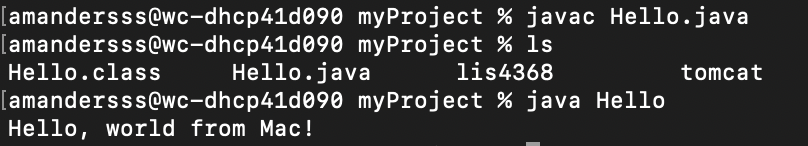
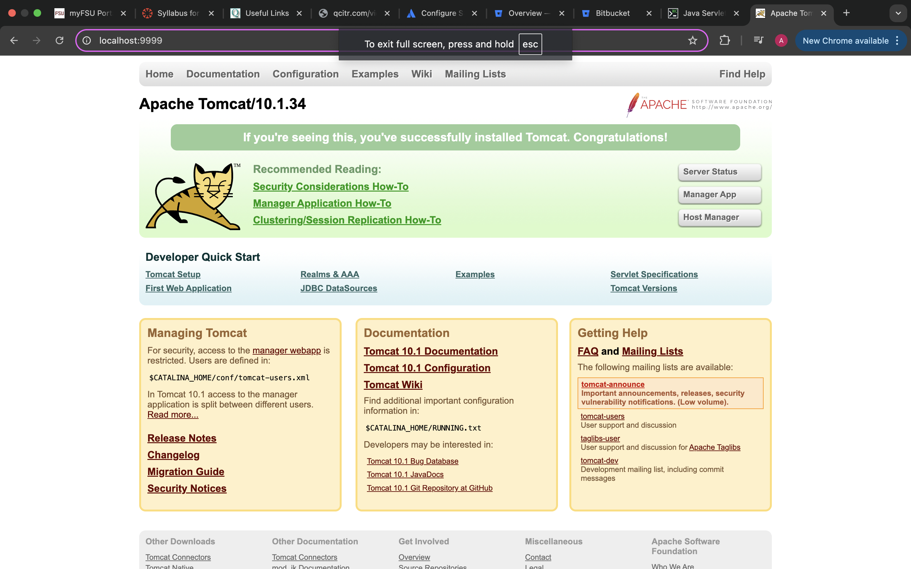
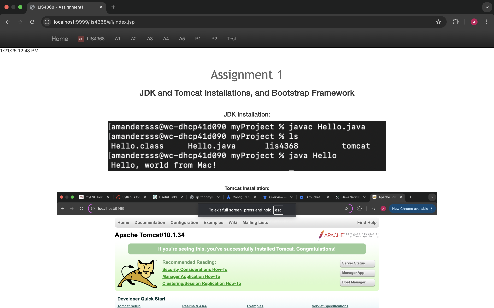

# LIS4368 - Advanced Web Applications Development

## Amanda Leon

### Assignment 1 Requirements:

_Three Parts:_

1. Download Version Control with Git and Bitbucket
2. Development Installations
3. Chapter Questions (ch 1 - 4)

#### README.md file should include the following items:

- Screenshot of running java Hello (#1 above);
- Screenshot of running http://localhost:9999 (#2 above, Step #4(b) in tutorial);
- Screenshot of a1/index.jsp
- git commands w/short descriptions;

## Git Commands

1. Init - Create an empty Git repository or reinitialize an existing one
2. Status - Show the working tree status
3. Add - Add file contents to the index
4. Commit - Record changes to the repository
5. Push - git-push - Update remote refs along with associated objects
6. Pull - Fetch from and integrate with another repository or a local branch
7. Checkout - Switch branches or restore working tree files

#### Assignment Screenshots

