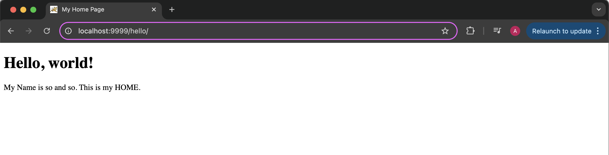
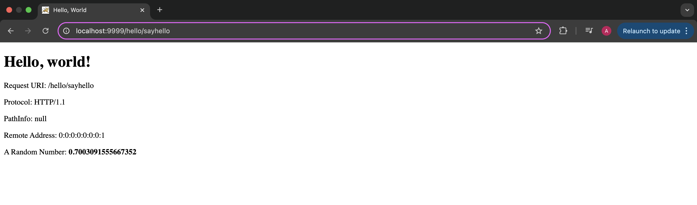
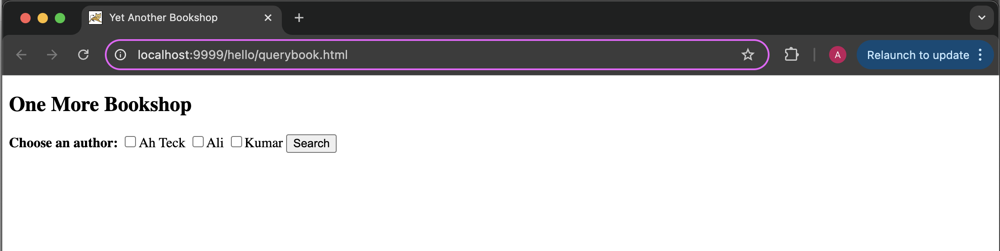
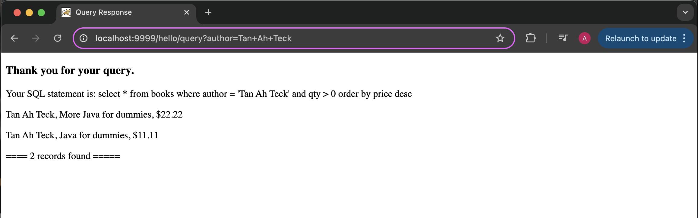
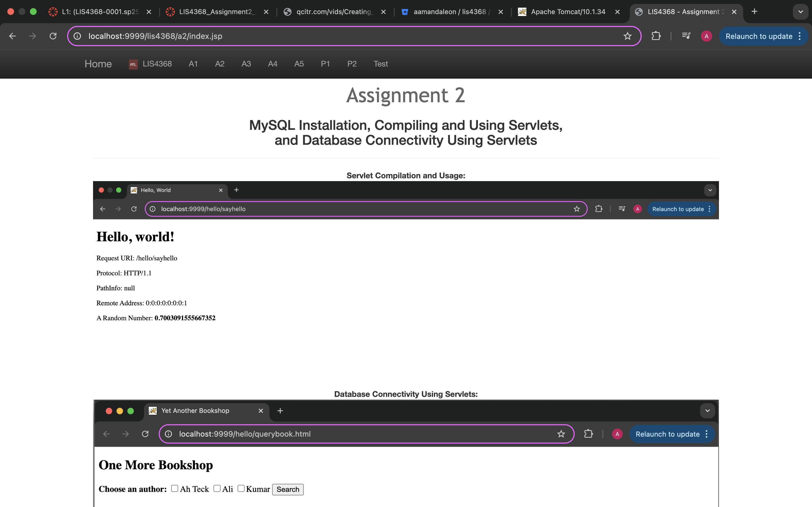
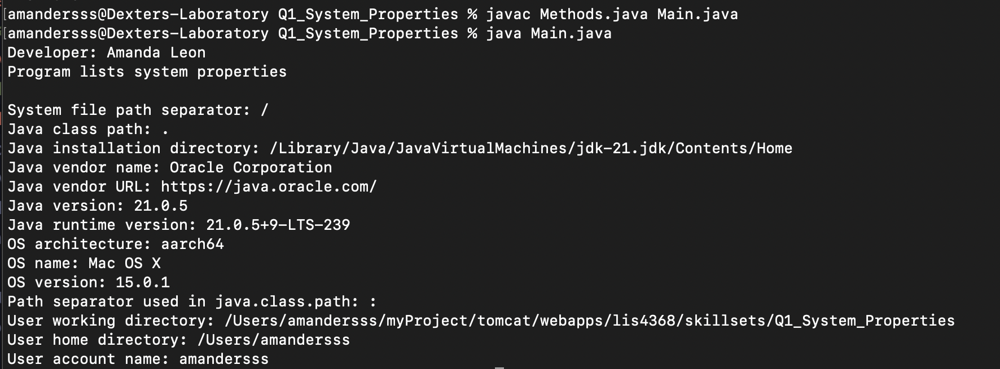
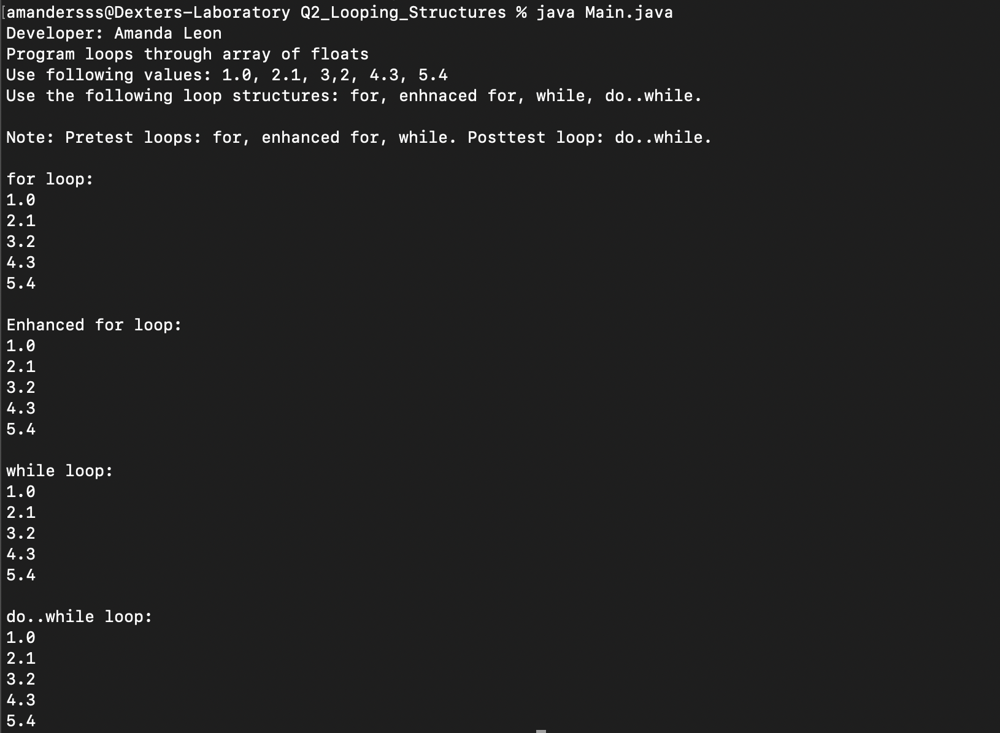
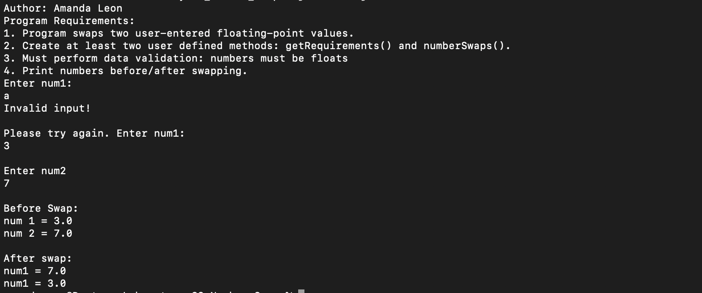

# LIS4368 - Advanced Web Applications Development

## Amanda Leon

### Assignment 2 Requirements:

_Four Parts:_

1. Download MySQL Workbench and create a local connection
2. Write and compile "Hello-world" Java Servlet
3. Write and compile Database Servlet
4. Chapter Questions (ch 5 and 6)

#### README.md file should include the following items:

- Assessment links
- Screenshot of querybook.html
- Screenshot of the query results
- Screenshot of a2/index.jsp

#### Assignment Screenshots

#### Skillset Screenshots

