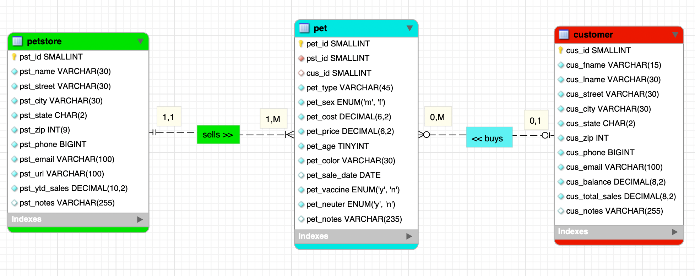
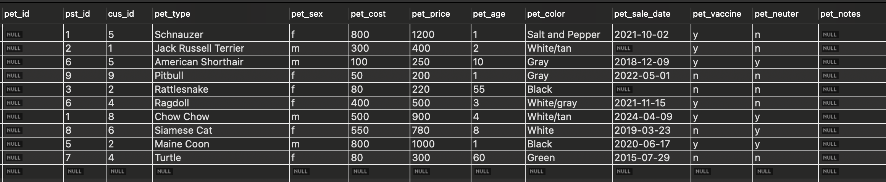
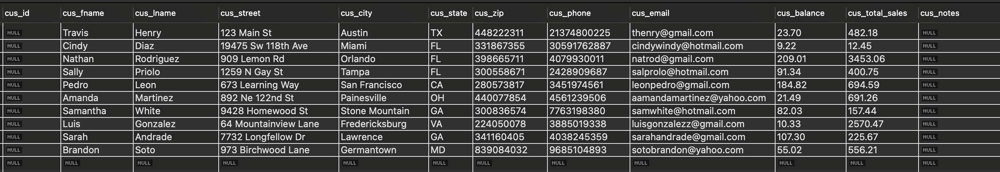
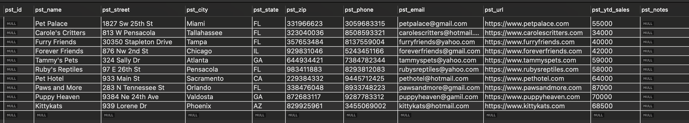
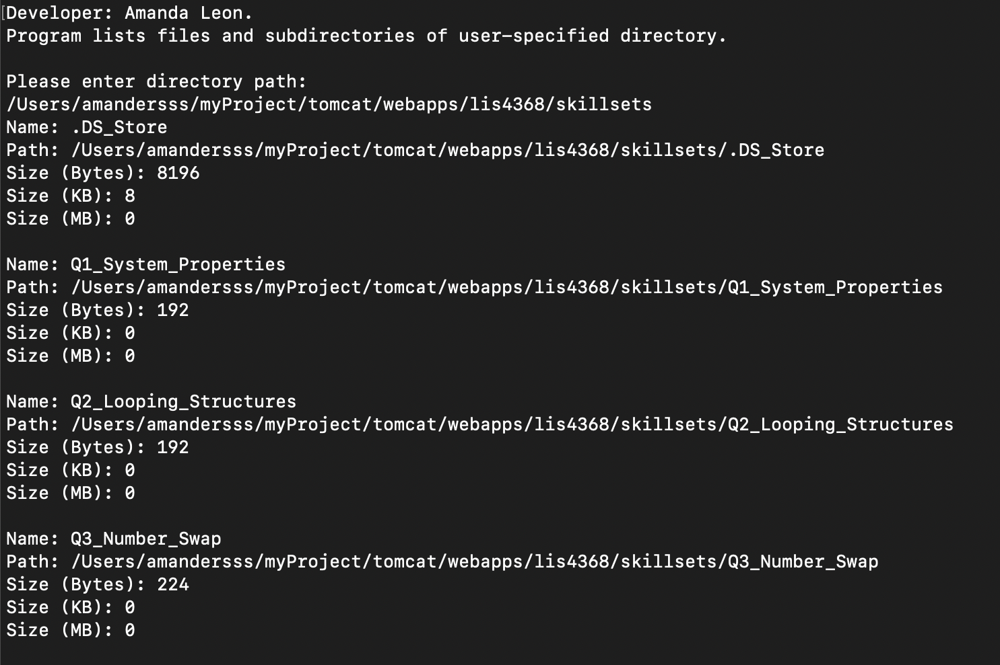
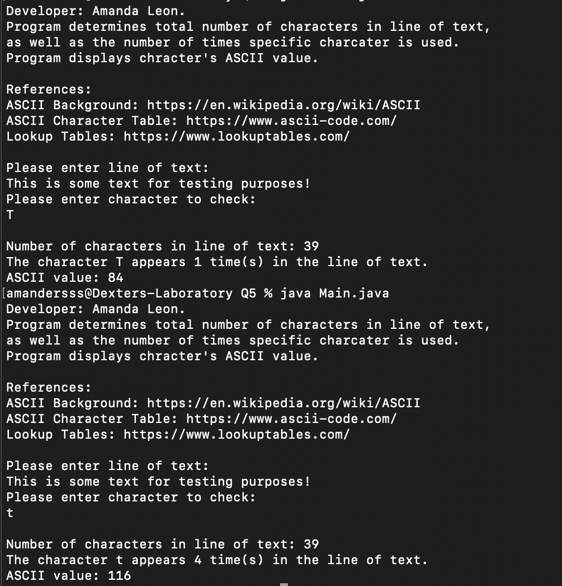
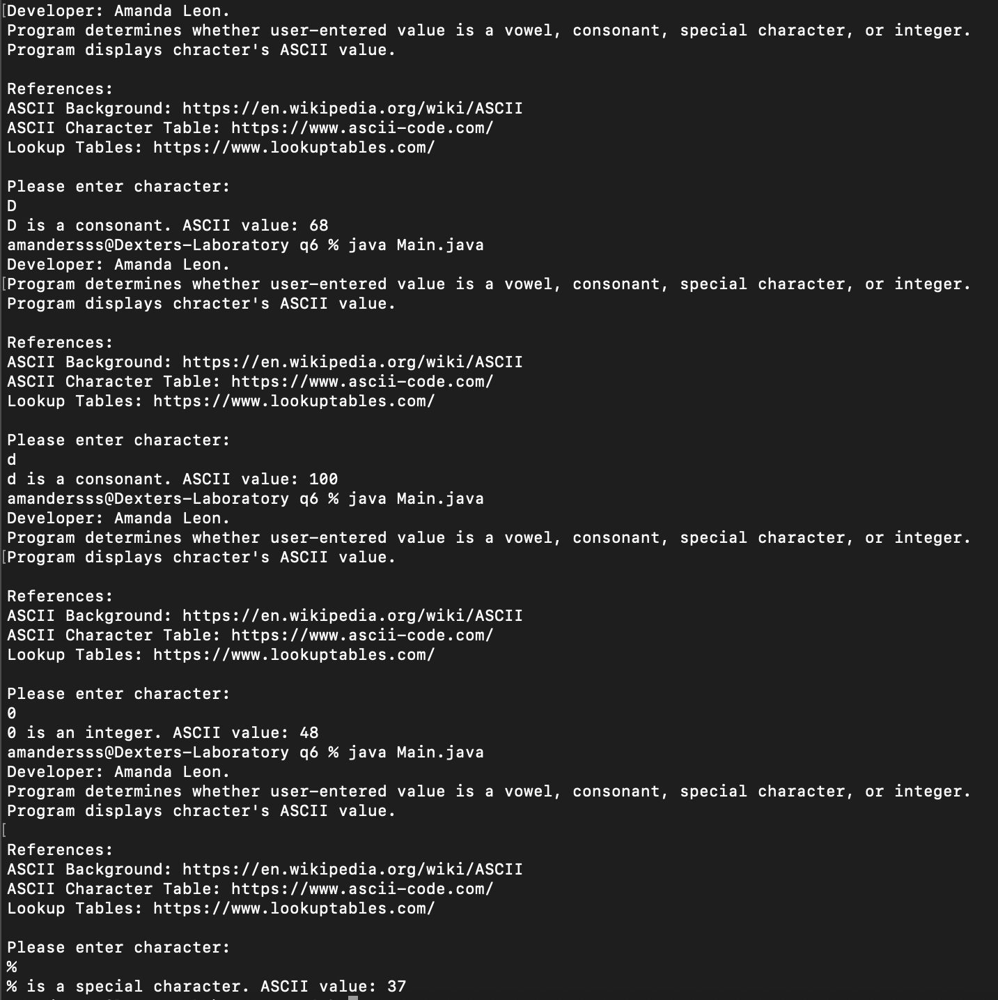

# LIS4368 - Advanced Web Applications Development

## Amanda Leon

### Assignment 3 Requirements:

_Four Parts:_

1. Create Entity Relationship Diagram (ERD)
2. Include at least 10 records of data
3. Skillsets 4, 5, and 6
4. Chapter Questions (ch 7 and 8)

#### README.md file should include the following items:

- Screenshot of ERD
- Screenshot of 10 records for each table
- Screenshot of a3/index.jsp
- links to a3.sql and a3.mwb
- Screenshot of skillsets

#### Assignment Screenshot and Links

_Screenshot A3 ERD_:

_A3 docs: a3.mwb and a3.sql_:

[A3 MWB File](docs/a3.mwb "A3 ERD in .mwb format")
[A3 SQL File](docs/a3.sql "A3 SQL Script")

_Pet table data_

_Customer table data_

_Petstore table data_

### Skillset Screenshots

_Directory Info_

_Character Info_

_Determine Character_

