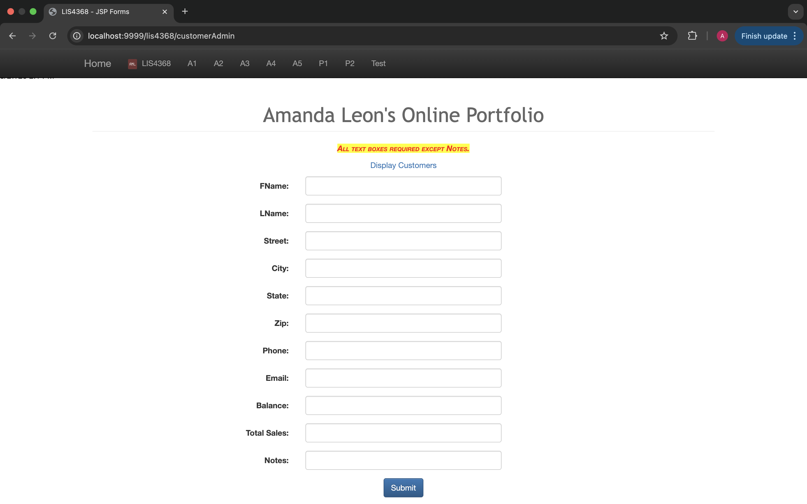
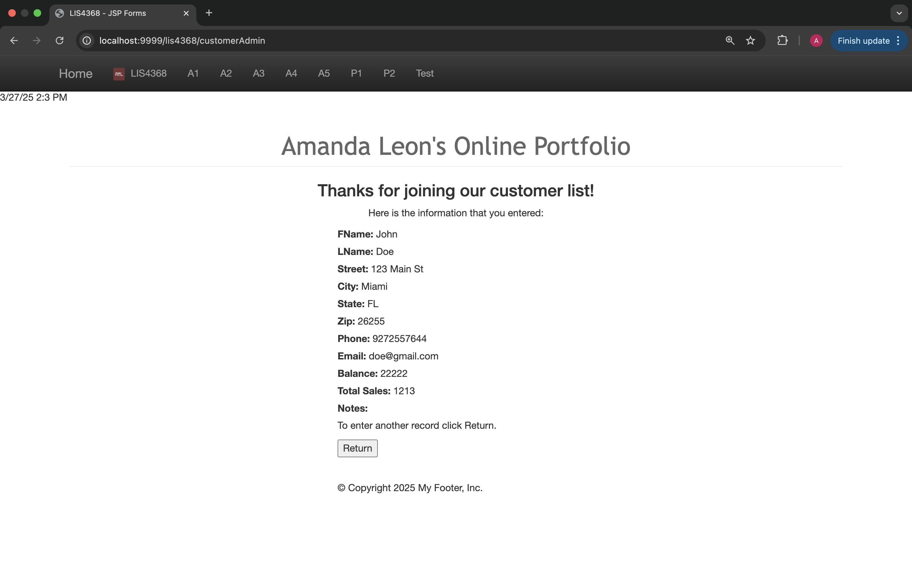
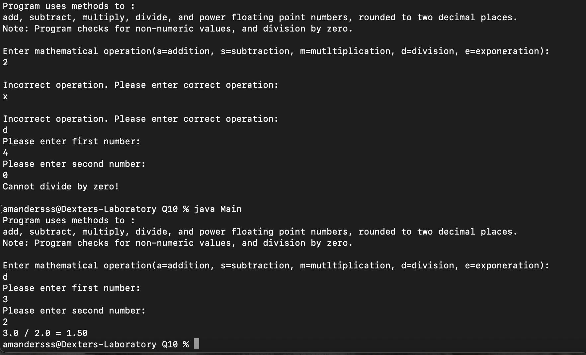
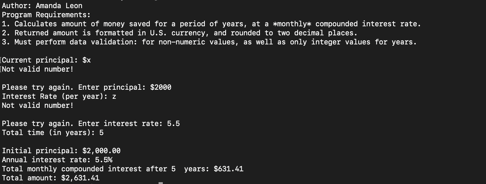
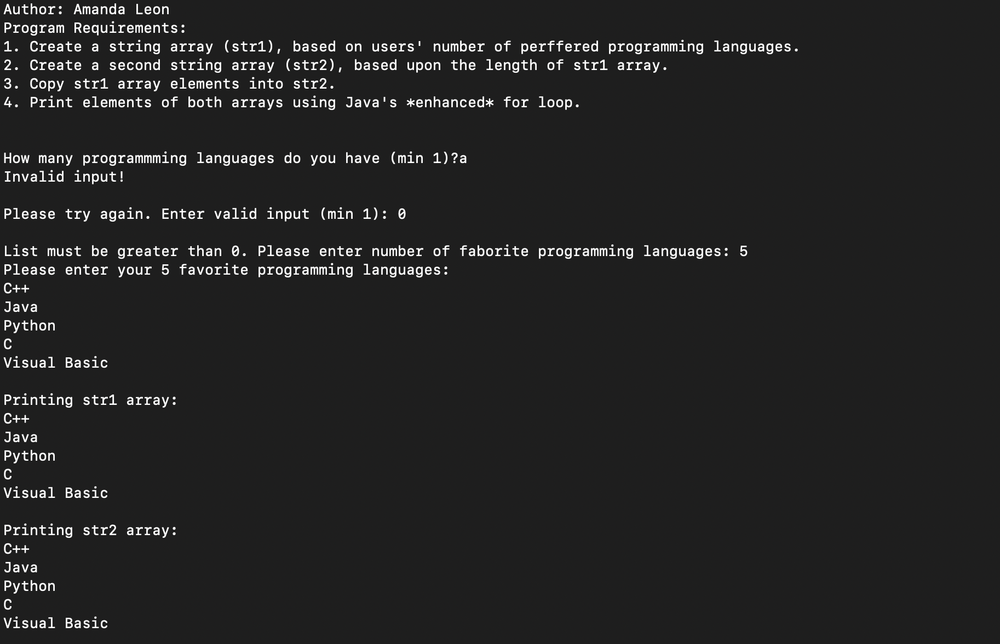

# LIS4368 - Advanced Web Applications Development

## Amanda Leon

### Assignment 4 Requirements:

_Four Parts:_

1. Modify jsp files and compile servelets
2. Create server-side validation
3. Skillsets 10, 11, and 12
4. Chapter Questions (ch 11 and 12)

#### README.md file should include the following items:

- Screenshot of failed validation
- Screenshot of passed validation
- Screenshot of skillsets

#### Assignment Screenshot and Links

_Failed Validation_

_Passed Validation_

### Skillset Screenshots

_Simple Calculator_

_Compund Interest Calculator_

_Array Copy_

