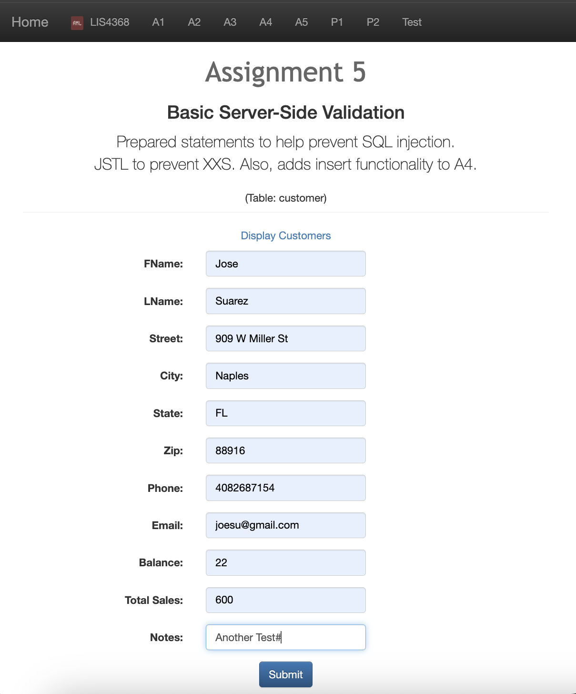
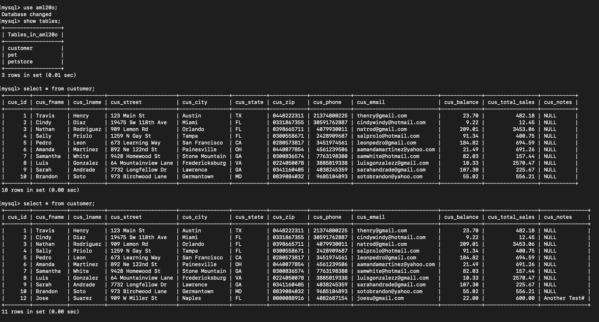
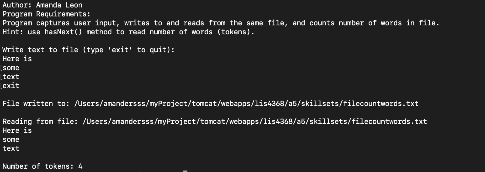
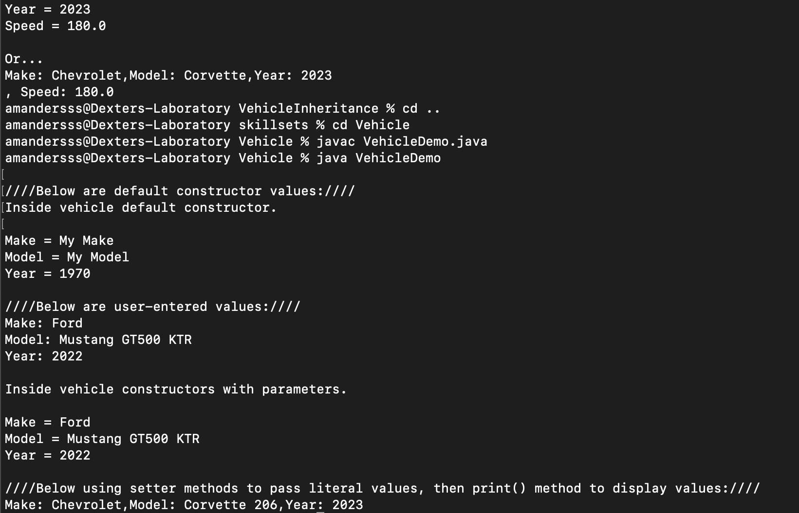
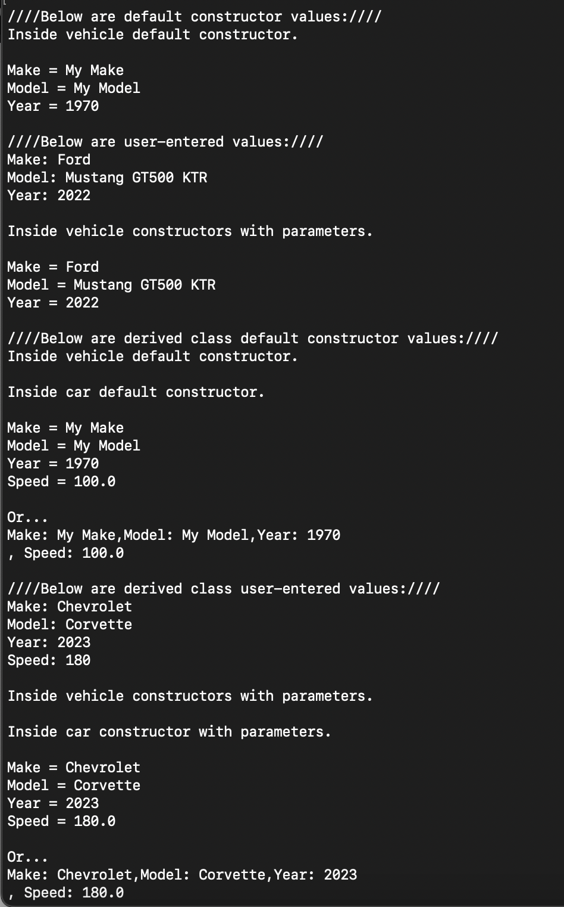

# LIS4368 - Advanced Web Applications Development

## Amanda Leon

### Assignment 5 Requirements:

1. Compile class and servlet files
2. Perform basic server-side validation
3. Add insert functionality to A4
4.  Skillsets 13, 14, and 15
5. Chapter uestions (ch 13-15)

#### README.md file should include the following items:

- Screenshot of valid user form entry
- Screenshot of passed validation
- Screenshot of associated database entry
- Screenshot of skillsets

### Assignment Screenshots 

#### Valid User Form Entry (customerform.jsp)

#### Passed Validation (thanks.jsp)

#### Associated Database Entry

### Skillset Screenshots

#### File Write Read Count Words

#### Java: Vehicle (Base/Super/Parent) Class

#### Java: Car (Sub/Derived/Child) Class Inherits Vehicle Class

