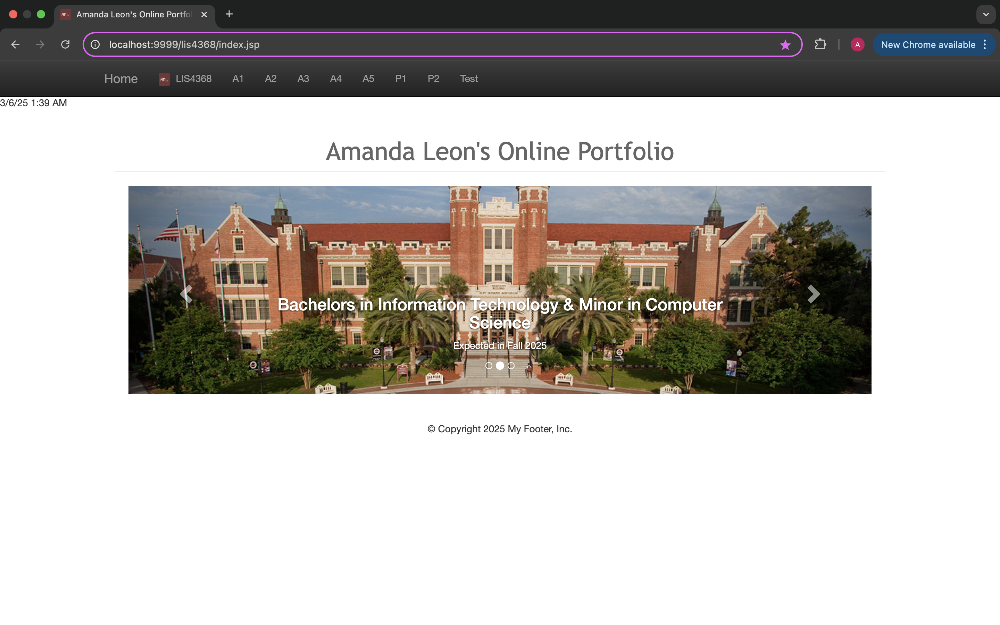
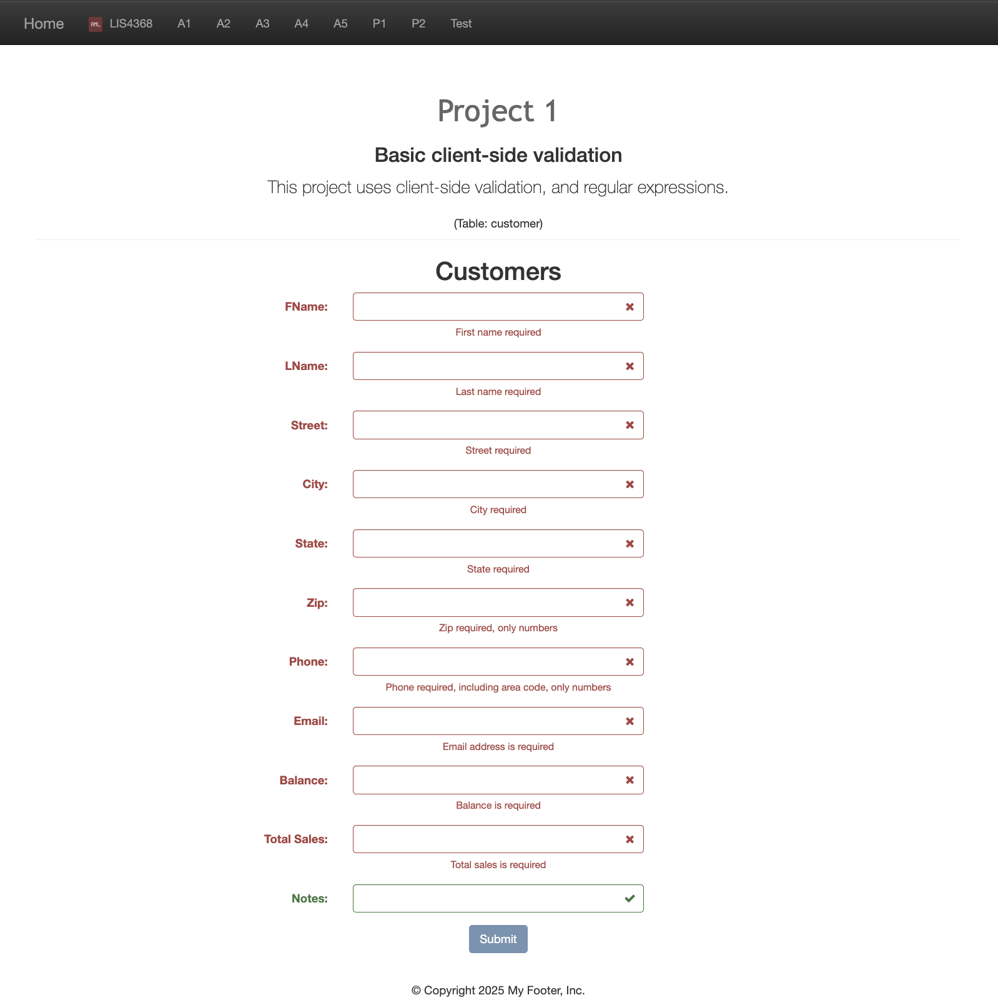
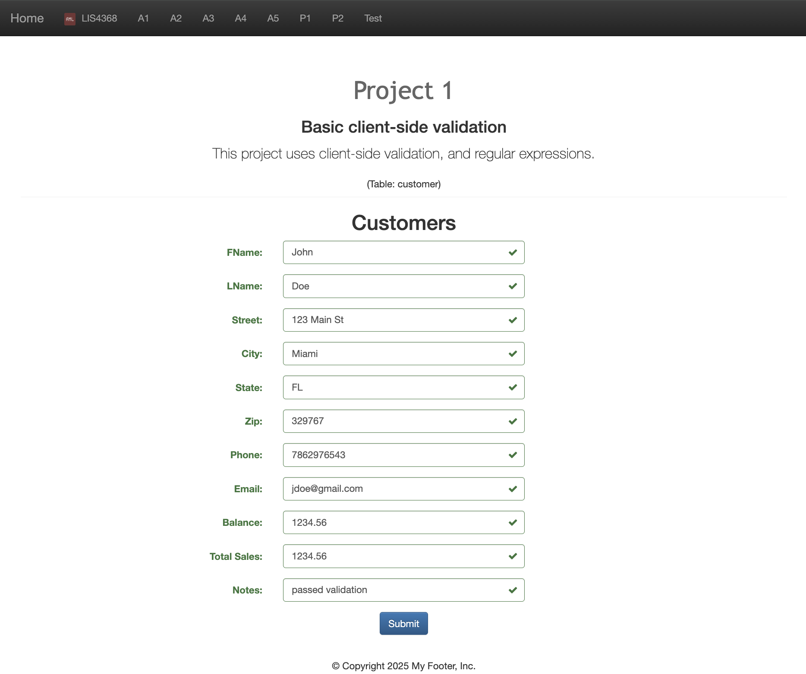
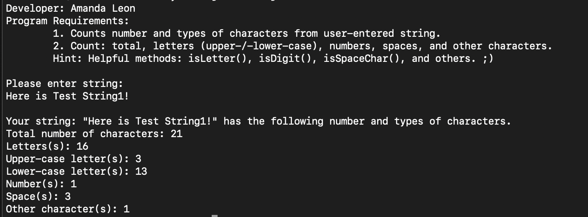
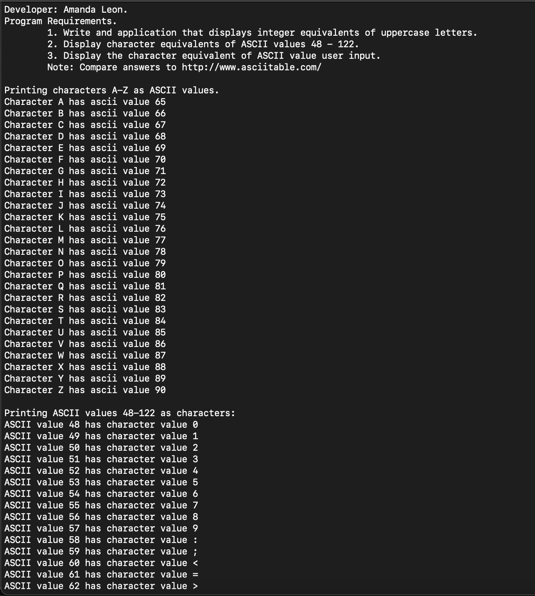
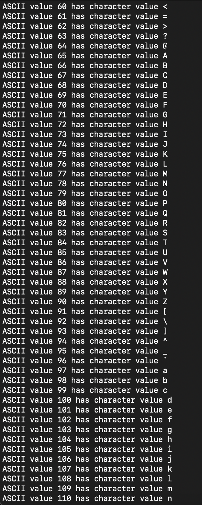
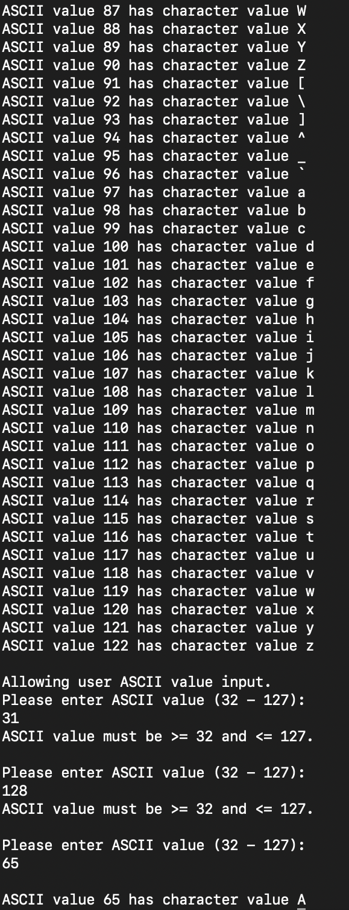
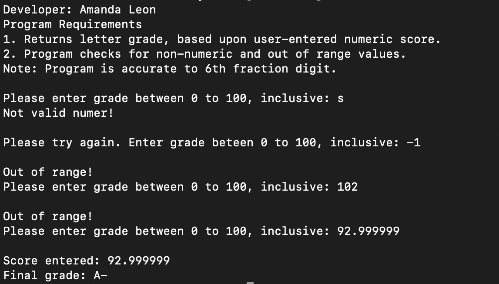

# LIS4368 - Advanced Web Applications Development

## Amanda Leon

### Project 1 Requirements:

1. Open index.jsp and review code:
   - Suitably modify meta tags
   - Change title, navigation links, and header tags appropriately
   - Add form controls to match attributes of customer entity
2. Add jQuery validation and regular expressions-- as per the entity attribute requirements
   - Use min/max jQuery validation
   - Use regexp to only allow appropriate characters for each control
3. Skillsets 7, 8, and 9
4. Chapter uestions (ch 9 and 10)

#### README.md file should include the following items:

- Screenshot of LIS4368 Portal (Main/Splash Page)
- Screenshot of failed validation
- Screenshot of passed validation
- Screenshot of skillsets

### Assignment Screenshots

#### LIS4368 Portal (Main/Splash Page)

#### Failed Validation

#### Passed Validation

### Skillset Screenshots

#### Count Chracters

#### ASCII

#### Grade Calculator

